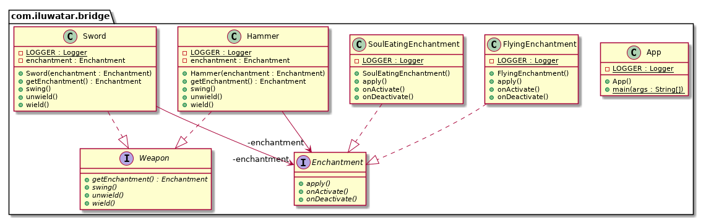

## 又被称为

手柄/身体模式

## 目的

将抽象与其实现分离，以便二者可以独立变化。

## 解释

真实世界例子

> 考虑一下你拥有一种具有不同附魔的武器，并且应该允许将具有不同附魔的不同武器混合使用。 你会怎么做？ 为每个附魔创建每种武器的多个副本，还是只是创建单独的附魔并根据需要为武器设置它？ 桥接模式使您可以进行第二次操作。

通俗的说

> 桥接模式是一个更推荐组合而不是继承的模式。将实现细节从一个层次结构推送到具有单独层次结构的另一个对象。

维基百科说

> 桥接模式是软件工程中使用的一种设计模式，旨在“将抽象与其实现分离，从而使两者可以独立变化”

**程序示例**

翻译一下上面的武器示例。下面我们有武器的类层级：

```java
public interface Weapon {
  void wield();
  void swing();
  void unwield();
  Enchantment getEnchantment();
}

public class Sword implements Weapon {

  private final Enchantment enchantment;

  public Sword(Enchantment enchantment) {
    this.enchantment = enchantment;
  }

  @Override
  public void wield() {
    LOGGER.info("The sword is wielded.");
    enchantment.onActivate();
  }

  @Override
  public void swing() {
    LOGGER.info("The sword is swinged.");
    enchantment.apply();
  }

  @Override
  public void unwield() {
    LOGGER.info("The sword is unwielded.");
    enchantment.onDeactivate();
  }

  @Override
  public Enchantment getEnchantment() {
    return enchantment;
  }
}

public class Hammer implements Weapon {

  private final Enchantment enchantment;

  public Hammer(Enchantment enchantment) {
    this.enchantment = enchantment;
  }

  @Override
  public void wield() {
    LOGGER.info("The hammer is wielded.");
    enchantment.onActivate();
  }

  @Override
  public void swing() {
    LOGGER.info("The hammer is swinged.");
    enchantment.apply();
  }

  @Override
  public void unwield() {
    LOGGER.info("The hammer is unwielded.");
    enchantment.onDeactivate();
  }

  @Override
  public Enchantment getEnchantment() {
    return enchantment;
  }
}
```

这里是单独的附魔类结构：

```java
public interface Enchantment {
  void onActivate();
  void apply();
  void onDeactivate();
}

public class FlyingEnchantment implements Enchantment {

  @Override
  public void onActivate() {
    LOGGER.info("The item begins to glow faintly.");
  }

  @Override
  public void apply() {
    LOGGER.info("The item flies and strikes the enemies finally returning to owner's hand.");
  }

  @Override
  public void onDeactivate() {
    LOGGER.info("The item's glow fades.");
  }
}

public class SoulEatingEnchantment implements Enchantment {

  @Override
  public void onActivate() {
    LOGGER.info("The item spreads bloodlust.");
  }

  @Override
  public void apply() {
    LOGGER.info("The item eats the soul of enemies.");
  }

  @Override
  public void onDeactivate() {
    LOGGER.info("Bloodlust slowly disappears.");
  }
}
```

这里是两种层次结构的实践：

```java
var enchantedSword = new Sword(new SoulEatingEnchantment());
enchantedSword.wield();
enchantedSword.swing();
enchantedSword.unwield();
// The sword is wielded.
// The item spreads bloodlust.
// The sword is swinged.
// The item eats the soul of enemies.
// The sword is unwielded.
// Bloodlust slowly disappears.

var hammer = new Hammer(new FlyingEnchantment());
hammer.wield();
hammer.swing();
hammer.unwield();
// The hammer is wielded.
// The item begins to glow faintly.
// The hammer is swinged.
// The item flies and strikes the enemies finally returning to owner's hand.
// The hammer is unwielded.
// The item's glow fades.
```


## 类图



## 适用性

使用桥接模式当

* 你想永久性的避免抽象和他的实现之间的绑定。有可能是这种情况，当实现需要被选择或者在运行时切换。
* 抽象和他们的实现应该能通过写子类来扩展。这种情况下，桥接模式让你可以组合不同的抽象和实现并独立的扩展他们。
* 对抽象的实现的改动应当不会对客户产生影响；也就是说，他们的代码不必重新编译。
* 你有种类繁多的类。这样的类层次结构表明需要将一个对象分为两部分。Rumbaugh 使用术语“嵌套归纳”来指代这种类层次结构。
* 你想在多个对象间分享一种实现（可能使用引用计数），这个事实应该对客户隐藏. 一个简单的示例是Coplien的String类, 其中多个对象可以共享同一字符串表示形式

## 模式优缺点
* 你可以创建与平台无关的类和程序
* 客户端代码仅与高层抽象部分进行互动,不会接触到平台的详细信息
* 开闭原则: 你可以新增抽象部分和实现部分, 且它们之间不会相互影响
* 单一职责原则: 抽象部分专注于处理高层逻辑, 实现部分处理平台细节
* 对高内聚的类使用该模式可能会让代码更加复杂

## 与其他模式的关系
和适配器模式连用
桥接模式是设计初期的, 适配器模式是可能开发中期的。他们位于系统设计的不同阶段。当我们发现现有的类和我们正在开发的系统无法协同工作就可以使用适配器模式。
而所适配的可能就是桥接的某个维度接口的某个功能实现。比如：一个系统的数据采集可以有文本，csv，数据库，我们有现成的数据库的连接库，这时候就要一个适配器来适配这个库，并实现数据采集的接口来实现桥接。

## 附

* [桥接模式说明文档(Bridge)](../../../docs/design-patterns/combine/桥接模式.md)

## 教程

* [Bridge Pattern Tutorial](https://www.journaldev.com/1491/bridge-design-pattern-java)

## 鸣谢

* [Design Patterns: Elements of Reusable Object-Oriented Software](https://www.amazon.com/gp/product/0201633612/ref=as_li_tl?ie=UTF8&camp=1789&creative=9325&creativeASIN=0201633612&linkCode=as2&tag=javadesignpat-20&linkId=675d49790ce11db99d90bde47f1aeb59)
* [Head First Design Patterns: A Brain-Friendly Guide](https://www.amazon.com/gp/product/0596007124/ref=as_li_tl?ie=UTF8&camp=1789&creative=9325&creativeASIN=0596007124&linkCode=as2&tag=javadesignpat-20&linkId=6b8b6eea86021af6c8e3cd3fc382cb5b)
