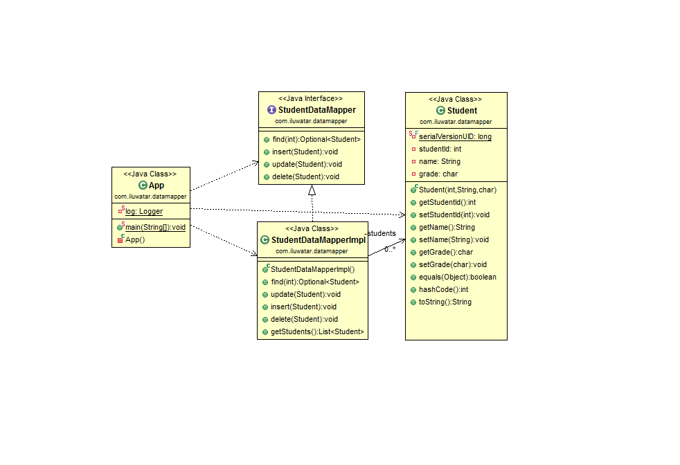

## 含义
一个用于在持久化对象和数据库之间传输数据的映射器，同时保持它们之间和映射器本身的独立性, 映射器(Mapper)是指在两个独立对象之间建立通信的对象

## 类图

## 说明
   
* Data Mapper是一个软件层，用于将内存中对象与数据库分开.
* 它的职责是在两者之间传输数据, 并将它们彼此隔离.
* 使用Data Mapper,即使存在数据库, 内存中的对象也不需要知道, 他们不需要SQL接口代码, 当然也不需要了解数据库模式 

## 适用场景
数据映射器适用于以下场景：

* 当你想把数据对象从数据库访问层解耦时时
* 当你想编写多个数据查询/持久化实现时

## 引用

* [Data Mapper](http://richard.jp.leguen.ca/tutoring/soen343-f2010/tutorials/implementing-data-mapper/)
* [数据映射器模式](https://www.jdon.com/51931)