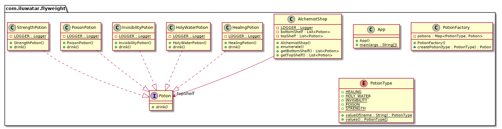

## Intent

Use sharing to support large numbers of fine-grained objects efficiently.

运用共享技术来有效地支持大量细粒度对象的复用, 它通过共享已经存在的对象来大幅度减少需要创建的对象数量、避免大量相似对象的开销, 从而提高系统资源的利用率

## 结构
   
### 享元(Flyweight)模式中存在以下两种状态: 
* 内部状态: 即不会随着环境的改变而改变的可共享部分
* 外部状态: 指随环境改变而改变的不可以共享的部分, 享元模式的实现要领就是区分应用中的这两种状态, 并将外部状态外部化

### 享元模式的主要有以下角色: 
* 抽象享元角色(Flyweight): 通常是一个接口或抽象类, 在抽象享元类中声明了具体享元类公共的方法, 这些方法可以向外界提供享元对象的内部数据(内部状态), 同时也可以通过这些方法来设置外部数据(外部状态)
* 具体享元(Concrete Flyweight)角色 : 它实现了抽象享元类, 称为享元对象, 在具体享元类中为内部状态提供了存储空间, 通常我们可以结合单例模式来设计具体享元类, 为每一个具体享元类提供唯一的享元对象
* 非享元(Unsharable Flyweight)角色 : 并不是所有的抽象享元类的子类都需要被共享, 不能被共享的子类可设计为非共享具体享元类, 当需要一个非共享具体享元类的对象时可以直接通过实例化创建
* 享元工厂(Flyweight Factory)角色 : 负责创建和管理享元角色。当客户对象请求一个享元对象时, 享元工厂检査系统中是否存在符合要求的享元对象, 如果存在则提供给客户；如果不存在的话, 则创建一个新的享元对象

## Explanation

Real-world example

> Alchemist's shop has shelves full of magic potions. Many of the potions are the same so there is 
> no need to create a new object for each of them. Instead, one object instance can represent 
> multiple shelf items so the memory footprint remains small.

In plain words

> It is used to minimize memory usage or computational expenses by sharing as much as possible with 
> similar objects.

Wikipedia says

> In computer programming, flyweight is a software design pattern. A flyweight is an object that 
> minimizes memory use by sharing as much data as possible with other similar objects; it is a way 
> to use objects in large numbers when a simple repeated representation would use an unacceptable 
> amount of memory.

**Programmatic example**

Translating our alchemist shop example from above. First of all, we have different potion types:

```java
public interface Potion {
  void drink();
}

@Slf4j
public class HealingPotion implements Potion {
  @Override
  public void drink() {
    LOGGER.info("You feel healed. (Potion={})", System.identityHashCode(this));
  }
}

@Slf4j
public class HolyWaterPotion implements Potion {
  @Override
  public void drink() {
    LOGGER.info("You feel blessed. (Potion={})", System.identityHashCode(this));
  }
}

@Slf4j
public class InvisibilityPotion implements Potion {
  @Override
  public void drink() {
    LOGGER.info("You become invisible. (Potion={})", System.identityHashCode(this));
  }
}
```

Then the actual Flyweight class `PotionFactory`, which is the factory for creating potions.

```java
public class PotionFactory {

  private final Map<PotionType, Potion> potions;

  public PotionFactory() {
    potions = new EnumMap<>(PotionType.class);
  }

  Potion createPotion(PotionType type) {
    var potion = potions.get(type);
    if (potion == null) {
      switch (type) {
        case HEALING:
          potion = new HealingPotion();
          potions.put(type, potion);
          break;
        case HOLY_WATER:
          potion = new HolyWaterPotion();
          potions.put(type, potion);
          break;
        case INVISIBILITY:
          potion = new InvisibilityPotion();
          potions.put(type, potion);
          break;
        default:
          break;
      }
    }
    return potion;
  }
}
```

`AlchemistShop` contains two shelves of magic potions. The potions are created using the
aforementioned `PotionFactory`.

```java
@Slf4j
public class AlchemistShop {

  private final List<Potion> topShelf;
  private final List<Potion> bottomShelf;

  public AlchemistShop() {
    var factory = new PotionFactory();
    topShelf = List.of(
        factory.createPotion(PotionType.INVISIBILITY),
        factory.createPotion(PotionType.INVISIBILITY),
        factory.createPotion(PotionType.STRENGTH),
        factory.createPotion(PotionType.HEALING),
        factory.createPotion(PotionType.INVISIBILITY),
        factory.createPotion(PotionType.STRENGTH),
        factory.createPotion(PotionType.HEALING),
        factory.createPotion(PotionType.HEALING)
    );
    bottomShelf = List.of(
        factory.createPotion(PotionType.POISON),
        factory.createPotion(PotionType.POISON),
        factory.createPotion(PotionType.POISON),
        factory.createPotion(PotionType.HOLY_WATER),
        factory.createPotion(PotionType.HOLY_WATER)
    );
  }

  public final List<Potion> getTopShelf() {
    return List.copyOf(this.topShelf);
  }

  public final List<Potion> getBottomShelf() {
    return List.copyOf(this.bottomShelf);
  }

  public void drinkPotions() {
    LOGGER.info("Drinking top shelf potions\n");
    topShelf.forEach(Potion::drink);
    LOGGER.info("Drinking bottom shelf potions\n");
    bottomShelf.forEach(Potion::drink);
  }
}
```

In our scenario, a brave visitor enters the alchemist shop and drinks all the potions.

```java
// create the alchemist shop with the potions
var alchemistShop = new AlchemistShop();
// a brave visitor enters the alchemist shop and drinks all the potions
alchemistShop.drinkPotions();
```

Program output:

```java
Drinking top shelf potions 
You become invisible. (Potion=1509514333)
You become invisible. (Potion=1509514333)
You feel strong. (Potion=739498517)
You feel healed. (Potion=125130493)
You become invisible. (Potion=1509514333)
You feel strong. (Potion=739498517)
You feel healed. (Potion=125130493)
You feel healed. (Potion=125130493)
Drinking bottom shelf potions
Urgh! This is poisonous. (Potion=166239592)
Urgh! This is poisonous. (Potion=166239592)
Urgh! This is poisonous. (Potion=166239592)
You feel blessed. (Potion=991505714)
You feel blessed. (Potion=991505714)
```

## Class diagram




## 优缺点和使用场景

1. 优点
* 极大减少内存中相似或相同对象数量, 节约系统资源, 提高系统性能
* 享元模式中的外部状态相对独立, 且不影响内部状态

2. 缺点：
* 为了使对象可以共享, 需要将享元对象的部分状态外部化, 分离内部状态和外部状态, 使程序逻辑复杂

## Applicability

The Flyweight pattern's effectiveness depends heavily on how and where it's used. Apply the 
Flyweight pattern when all of the following are true:

* An application uses a large number of objects.
* Storage costs are high because of the sheer quantity of objects.
* Most of the object state can be made extrinsic.
* Many groups of objects may be replaced by relatively few shared objects once the extrinsic state is removed.
* The application doesn't depend on object identity. Since flyweight objects may be shared, identity tests will return true for conceptually distinct objects.

* 一个系统有大量相同或者相似的对象, 造成内存的大量耗费
* 对象的大部分状态都可以外部化, 可以将这些外部状态传入对象中
* 在使用享元模式时需要维护一个存储享元对象的享元池, 而这需要耗费一定的系统资源, 因此应当在需要多次重复使用享元对象时才值得使用享元模式

## Known uses

* Integer类使用了享元模式
* [java.lang.Integer#valueOf(int)](http://docs.oracle.com/javase/8/docs/api/java/lang/Integer.html#valueOf%28int%29) and similarly for Byte, Character and other wrapped types. 

## Credits

* [Design Patterns: Elements of Reusable Object-Oriented Software](https://www.amazon.com/gp/product/0201633612/ref=as_li_tl?ie=UTF8&camp=1789&creative=9325&creativeASIN=0201633612&linkCode=as2&tag=javadesignpat-20&linkId=675d49790ce11db99d90bde47f1aeb59)
* [Head First Design Patterns: A Brain-Friendly Guide](https://www.amazon.com/gp/product/0596007124/ref=as_li_tl?ie=UTF8&camp=1789&creative=9325&creativeASIN=0596007124&linkCode=as2&tag=javadesignpat-20&linkId=6b8b6eea86021af6c8e3cd3fc382cb5b)
