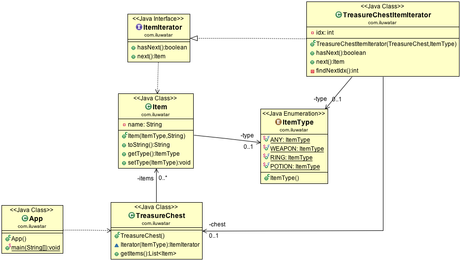

## 又被称为
**迭代器模式** (Iterator)：提供一种方法顺序访问一个聚合对象中的各种元素, 而又不暴露该对象的内部表示, 其别名为游标(Cursor)

## 目的
主要目的就是将对集合的遍历操作从类中抽取独立出来, 形成2个继承系统：聚合类抽象体系负责数据的存储删除等操作, 迭代器体系负责数据遍历读取的操作,   
客户端访问使用的方式都是一致的: 客户端只需要通过抽象聚合操作数据存储, 通过迭代器进行遍历数据

## 结构 (迭代器模式主要角色)
* 抽象聚合(Aggregate) 角色: 定义存储、添加、删除聚合元素以及创建迭代器对象的接口
* 具体聚合(ConcreteAggregate)角色：实现抽象聚合类, 返回一个具体迭代器的实例
* 抽象迭代器(Iterator)角色：定义访问和遍历聚合元素的接口, 通常包含 hasNext()  next() 等方法
* 具体迭代器(Concretelterator)角色：实现抽象迭代器接口中所定义的方法，完成对聚合对象的遍历, 记录遍历的当前位置

## 解释

真实世界例子

> 百宝箱包含一组魔法物品有多种物品, 例如戒指, 药水和武器可以使用藏宝箱提供的迭代器按类型浏览商品

通俗地说

> 容器可以提供与表示形式无关的迭代器接口, 以提供对元素的访问

维基百科说

> 在面向对象的编程中, 迭代器模式是一种设计模式, 其中迭代器用于遍历容器并访问容器的元素

**程序示例**

在我们的示例中包含物品的藏宝箱是主要类

```java
public class TreasureChest {

  private final List<Item> items;

  public TreasureChest() {
    items = List.of(
        new Item(ItemType.POTION, "Potion of courage"),
        new Item(ItemType.RING, "Ring of shadows"),
        new Item(ItemType.POTION, "Potion of wisdom"),
        new Item(ItemType.POTION, "Potion of blood"),
        new Item(ItemType.WEAPON, "Sword of silver +1"),
        new Item(ItemType.POTION, "Potion of rust"),
        new Item(ItemType.POTION, "Potion of healing"),
        new Item(ItemType.RING, "Ring of armor"),
        new Item(ItemType.WEAPON, "Steel halberd"),
        new Item(ItemType.WEAPON, "Dagger of poison"));
  }

  public Iterator<Item> iterator(ItemType itemType) {
    return new TreasureChestItemIterator(this, itemType);
  }

  public List<Item> getItems() {
    return new ArrayList<>(items);
  }
}

public class Item {

  private ItemType type;
  private final String name;

  public Item(ItemType type, String name) {
    this.setType(type);
    this.name = name;
  }

  @Override
  public String toString() {
    return name;
  }

  public ItemType getType() {
    return type;
  }

  public final void setType(ItemType type) {
    this.type = type;
  }
}

public enum ItemType {

  ANY, WEAPON, RING, POTION

}
```

迭代器接口极度简单

```java
public interface Iterator<T> {

  boolean hasNext();

  T next();
}
```

在以下示例中, 我们遍历在宝箱中找到的戒指类型物品

```java
var itemIterator = TREASURE_CHEST.iterator(ItemType.RING);
while (itemIterator.hasNext()) {
  LOGGER.info(itemIterator.next().toString());
}
// Ring of shadows
// Ring of armor
```

## 类图


## 优缺点
1. 优点：
* 支持以不同的方式遍历一个聚合对象, 在同一个聚合对象上可以定义多种遍历方式, 在迭代器模式中只需要用一个不同的迭代器来替换原有迭代器即可改变遍历算法,我们也可以自己定义迭代器的子类以支持新的遍历方式
* 迭代器简化了聚合类, 由于引入了迭代器, 在原有的聚合对象中不需要再自行提供数据遍历等方法，这样可以简化聚合类的设计
* 在迭代器模式中, 由于引入了抽象层, 增加新的聚合类和迭代器类都很方便, 无须修改原有代码, 满足 “开闭原则” 的要求
2. 缺点：
* 增加了类的数量， 这在一定程度上增加了系统的复杂性。

## 适用性
以下情况使用迭代器模式

* 在不暴露其内部表示的情况下访问聚合对象的内容, 不暴露其内部实现细节的情况
* 为了支持聚合对象的多种遍历方式, 后面可能需要动态变化其遍历方式
* 提供一个遍历不同聚合结构的统一接口

## Java世界例子
* JDK源码解析 迭代器模式在JAVA的很多集合类 ArrayList
* [java.util.Iterator](http://docs.oracle.com/javase/8/docs/api/java/util/Iterator.html)
* [java.util.Enumeration](http://docs.oracle.com/javase/8/docs/api/java/util/Enumeration.html)

## 鸣谢

* [Design Patterns: Elements of Reusable Object-Oriented Software](https://www.amazon.com/gp/product/0201633612/ref=as_li_tl?ie=UTF8&camp=1789&creative=9325&creativeASIN=0201633612&linkCode=as2&tag=javadesignpat-20&linkId=675d49790ce11db99d90bde47f1aeb59)
* [Head First Design Patterns: A Brain-Friendly Guide](https://www.amazon.com/gp/product/0596007124/ref=as_li_tl?ie=UTF8&camp=1789&creative=9325&creativeASIN=0596007124&linkCode=as2&tag=javadesignpat-20&linkId=6b8b6eea86021af6c8e3cd3fc382cb5b)
