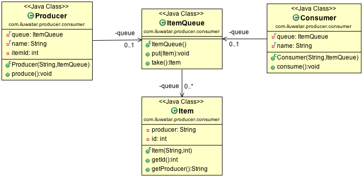

## 目的

生产者消费者设计模式是一种经典的并发模式, 通过将工作与执行工作任务分开来减少生产者与消费者之间的耦合, 达到生产者和消费者生产数据和消费数据之间的平衡. 

## 概述

* 当临界资源满了, 生产者必须阻塞等待;
* 当临界资源为空, 消费者必须阻塞等待;

## 结构

* 生产者线程
* 消费者线程
* 第三方(通常是阻塞队列)，也成为临界资源

## 类图

## 生产者-消费者模式的优点

* 解耦：将生产者类和消费者类进行解耦，消除代码之间的依赖性，简化工作负载的管理
* 复用：通过将生产者类和消费者类独立开来，那么可以对生产者类和消费者类进行独立的复用与扩展
* 调整并发数：由于生产者和消费者的处理速度是不一样的，可以调整并发数，给予慢的一方多的并发数，来提高任务的处理速度
* 异步：对于生产者和消费者来说能够各司其职，生产者只需要关心缓冲区是否还有数据，不需要等待消费者处理完；同样的对于消费者来说，也只需要关注缓冲区的内容，不需要关注生产者，通过异步的方式支持高并发，将一个耗时的流程拆成生产和消费两个阶段，这样生产者因为执行put()的时间比较短，而支持高并发
* 支持分布式：生产者和消费者通过队列进行通讯，所以不需要运行在同一台机器上，在分布式环境中可以通过redis的list作为队列，而消费者只需要轮询队列中是否有数据。同时还能支持集群的伸缩性，当某台机器宕掉的时候，不会导致整个集群宕掉

## 适用性
在以下情况下使用生产者消费者

* 通过将工作分成生产和消费两个工作进程来解耦系统
* 解决生产工作和消费工作需要不同时间的问题
* 任务的处理时间比较长的情况
