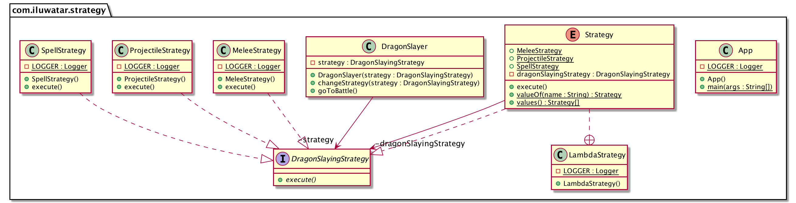

## 又被称为
政策（方针）模式

## 目的

定义一个家族算法，并封装好其中每一个，使它们可以互相替换。策略模式使算法的变化独立于使用它的客户。

## 解释

现实世界例子

> 屠龙是一项危险的职业。有经验将会使它变得简单。经验丰富的屠龙者对不同类型的龙有不同的战斗策略。       

直白点说

> 策略模式允许在运行时选择最匹配的算法。

维基百科上说

> 在程序编程领域，策略模式（又叫政策模式）是一种启用在运行时选择算法的行为型软件设计模式。

**编程实例**

让我们先介绍屠龙的策略模式接口和它的实现。

```java
@FunctionalInterface
public interface DragonSlayingStrategy {

  void execute();
}

@Slf4j
public class MeleeStrategy implements DragonSlayingStrategy {

  @Override
  public void execute() {
    LOGGER.info("With your Excalibur you sever the dragon's head!");
  }
}

@Slf4j
public class ProjectileStrategy implements DragonSlayingStrategy {

  @Override
  public void execute() {
    LOGGER.info("You shoot the dragon with the magical crossbow and it falls dead on the ground!");
  }
}

@Slf4j
public class SpellStrategy implements DragonSlayingStrategy {

  @Override
  public void execute() {
    LOGGER.info("You cast the spell of disintegration and the dragon vaporizes in a pile of dust!");
  }
}
```

现在有一个强力的屠龙者要基于上面的组件来选择他的战斗策略。

```java
public class DragonSlayer {

  private DragonSlayingStrategy strategy;

  public DragonSlayer(DragonSlayingStrategy strategy) {
    this.strategy = strategy;
  }

  public void changeStrategy(DragonSlayingStrategy strategy) {
    this.strategy = strategy;
  }

  public void goToBattle() {
    strategy.execute();
  }
}
```

最后是屠龙者的行动。

```java
    LOGGER.info("Green dragon spotted ahead!");
    var dragonSlayer = new DragonSlayer(new MeleeStrategy());
    dragonSlayer.goToBattle();
    LOGGER.info("Red dragon emerges.");
    dragonSlayer.changeStrategy(new ProjectileStrategy());
    dragonSlayer.goToBattle();
    LOGGER.info("Black dragon lands before you.");
    dragonSlayer.changeStrategy(new SpellStrategy());
    dragonSlayer.goToBattle();
    
    // Green dragon spotted ahead!
    // With your Excalibur you sever the dragon's head!
    // Red dragon emerges.
    // You shoot the dragon with the magical crossbow and it falls dead on the ground!
    // Black dragon lands before you.
    // You cast the spell of disintegration and the dragon vaporizes in a pile of dust!    
```

## 类图


## 优缺点

1.优点：
* 策略类之间可以自由切换, 由于策略类都实现同一个接口, 所以使它们之间可以自由切换
* 易于扩展: 增加一个新的策略只需要添加一个具体的策略类即可，基本不需要改变原有的代码，符合“开闭原则“, 避免使用多重条件选择语句(if else), 充分体现面向对象设计思想

2.缺点：
* 客户端必须知道所有的策略类，并自行决定使用哪一个策略类
* 策略模式将造成产生很多策略类，可以通过使用享元模式在一定程度上减少对象的数量

## 应用
使用策略模式当

* 许多相关的类只是行为不同。策略模式提供了一种为一种类配置多种行为的能力。
* 一个系统需要动态地在几种算法中选择一种时，可将每个算法封装到策略类中
* 一个类定义了多种行为，并且这些行为在这个类的操作中以多个条件语句的形式出现，可将每个条件分支移入它们各自的策略类中以代替这些条件语句。
* 系统中各算法彼此完全独立，且要求对客户隐藏具体算法的实现细节时。
* 系统要求使用算法的客户不应该知道其操作的数据时，可使用策略模式来隐藏与算法相关的数据结构。
* 多个类只区别在表现行为不同，可以使用策略模式，在运行时动态选择具体要执行的行为

## 模板方法 与 策略模式 比较
* 模板方法模式： compile-time algorithm selection by subclassing
* 策略模式：run-time algorithm selection by containment


## 教学
* JDK源码解析Comparator 中的策略模式, 在Arrays类中有一个 sort() 方法
* [Strategy Pattern Tutorial](https://www.journaldev.com/1754/strategy-design-pattern-in-java-example-tutorial)

## 鸣谢

* [Design Patterns: Elements of Reusable Object-Oriented Software](https://www.amazon.com/gp/product/0201633612/ref=as_li_tl?ie=UTF8&camp=1789&creative=9325&creativeASIN=0201633612&linkCode=as2&tag=javadesignpat-20&linkId=675d49790ce11db99d90bde47f1aeb59)
* [Functional Programming in Java: Harnessing the Power of Java 8 Lambda Expressions](https://www.amazon.com/gp/product/1937785467/ref=as_li_tl?ie=UTF8&camp=1789&creative=9325&creativeASIN=1937785467&linkCode=as2&tag=javadesignpat-20&linkId=7e4e2fb7a141631491534255252fd08b)
* [Head First Design Patterns: A Brain-Friendly Guide](https://www.amazon.com/gp/product/0596007124/ref=as_li_tl?ie=UTF8&camp=1789&creative=9325&creativeASIN=0596007124&linkCode=as2&tag=javadesignpat-20&linkId=6b8b6eea86021af6c8e3cd3fc382cb5b)
* [Refactoring to Patterns](https://www.amazon.com/gp/product/0321213351/ref=as_li_tl?ie=UTF8&camp=1789&creative=9325&creativeASIN=0321213351&linkCode=as2&tag=javadesignpat-20&linkId=2a76fcb387234bc71b1c61150b3cc3a7)
