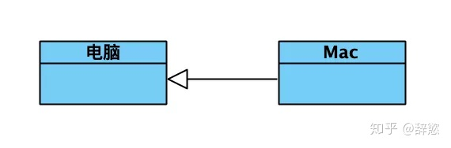
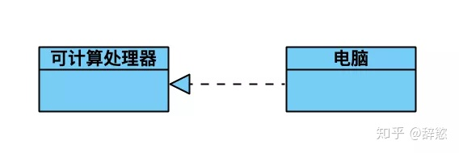
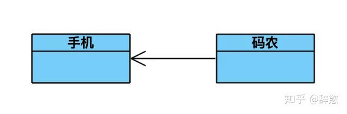
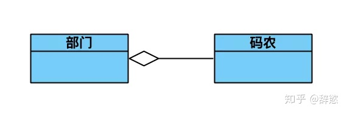
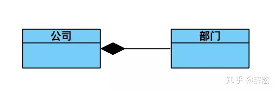
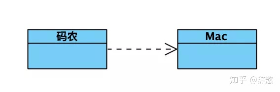
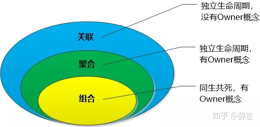
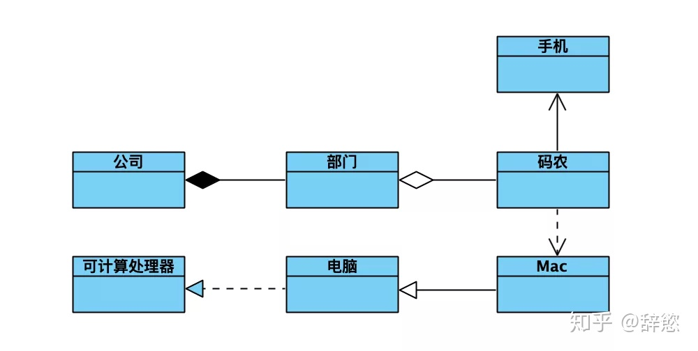

#UML 类图

## 类图表示法
具体类在类图中用矩形框表示, 矩形框分为三层：
1)  第一层是类名字
2)  第二层是类的成员变量
3)  第三层是类的方法
4)  抽象类的类名以及抽象方法的名字都用斜体字表示
5)  成员变量以及方法前的访问修饰符用下面的符号来表示:
* "+"  表示 public
* "-"  表示 private
* "#"  表示 protected
* 不带符号 表示 default

## 泛化关系(generalization)
泛化关系为 is-a 的关系；两个对象之间如果可以用 is-a 来表示, 就是泛化关系     
泛化关系用一条带空心箭头的直接表示. 如图为例,  Mac 和电脑就是泛化关系, 通常在程序里面泛化表现为继承于非抽象类. 
    
    
## 实现关系(realization)
实现关系用一条带实心箭头的虚线表示,如图为例, 电脑和可计算处理器就是实现关系     
通常程序里面实现关系表现为继承抽象类. 比如我们平时写的 Readable,Printable等接口的实现. 
    
    
## 关联关系(association) 关联又可以分为单向关联, 双向关联, 自关联
关联关系通常用一条直线表示, 当然如果需要标明方向可以添加箭头. 它是描书不同的类对象之间的关系, 通常不会随着状态的变化而变化, 可以理解为被关联者属于关联者的一部分. 如图为例, 手机就是码农的一部分, 不会因为他上班与否而变化所属关系. 
通常情况在程序里面以类变量的方式表现. 
    
    
## 聚合关系(aggregation)
聚合关系为 has-a 的关系     
聚合关系用一条带空心菱形箭头的直线表示, 如图码农和部门就是聚合关系. 与组合关系不同的是, 整体和部分不是强依赖的, 即使整体不存在了, 部分仍然存在. 如图为例,  部门撤销了, 码农换一个工作还是码农嘛. 
    
    
## 组合关系(composition)
组合关系为 has-a 的关系     
组合关系用一条带实心菱形箭头直线表示, 与聚合关系一样, 组合关系同样表示整体由部分构成的关系, 不同之处在于整体和部分是强依赖关系, 如果整体不存在了, 部分也不复存在. 如图为例, 如果公司倒闭了, 那么何来部门呢？
    
 
## 依赖关系(dependency)
依赖关系为 use-a 的关系     
依赖关系是用一套带箭头的虚线表示, 他通常描述一个对象在运行期间会用到另一个对象的关系. 如图为例码农只有在工作的时候才会用到 Mac 电脑, 所以这种依赖关系是依赖于运行状态的. 通常情况下是在程序里面通过构造函数、形参等体现. 
    
     

### 关联、聚合、组合之间的关系
依赖, 关联, 聚合, 组合都是利用关系, 区别是生命周期的相关性   
* 依赖: 用完就扔
* 关联: 聚合:不属于我, 但是用完先放着
* 组合: 是我的一部分, 用完保存好
   
    

## 总结
* 实箭泛化虚实现
* 虚线依赖实关联
* 空菱聚合实组合
* 项目沟通图常见 
* **依赖->关联->聚合->组合->继承->实现 耦合度依次增强, 划分模块的一个准则就是高内聚低耦合**

    
    

##参考
[UML规范](https://zhuanlan.zhihu.com/p/65065260) 
[设计模式之 UML 类图](https://zhuanlan.zhihu.com/p/24576502) 